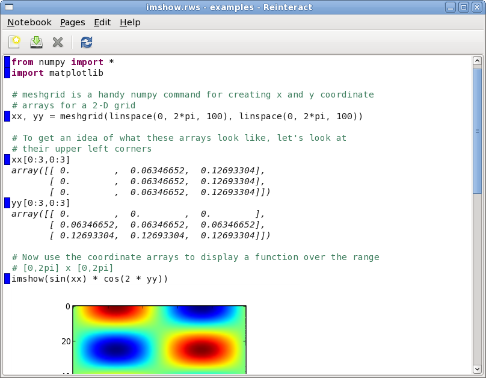
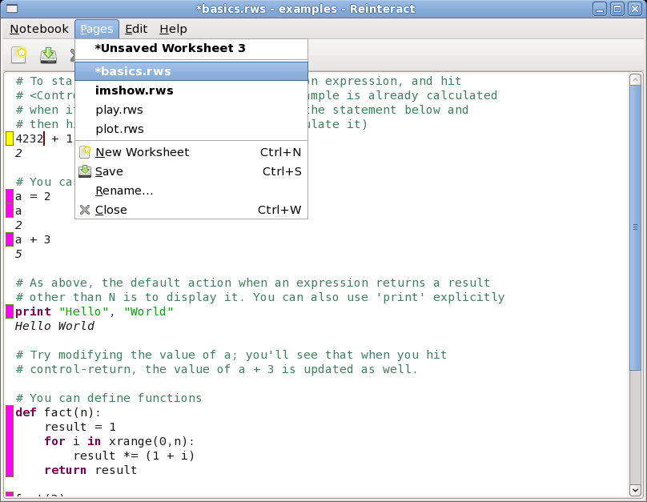

Design Notes for "Mini" User Interface
--------------------------------------

_Owen Taylor 2008-08-31_

### Assumptions ###

 * The mini user interface is designed for hand-held devices like smartphones or the Nokia Internet Tablet (N7xx/N8xx) with small amounts of screen real estate
 * The overall user interface on the device is task-based (use the Reinteract application) rather than file based (open this Reinteract Notebook/Worksheet)
 * The user is probably playing around with Python or doing calculations rather than creating a complex notebook with many interrelated files
 * Activities such as comparing worksheets in different notebooks or moving worksheets between notebooks are not interesting.

### Basic UI Ideas ###

The mini user interface is based on the standard Notebook user interface (see [Notebook Design](notebook.html)) ... the toplevel window represents a single notebook, and you can have multiple worksheets open at once within a notebook. Differences include:

 * The file list and notebooks tabs are replaced by a Pages menu which displays an integrated view of the worksheets in the notebook and the currently open worksheets (currently open worksheets are bold as they are in the standard file list)
 * The toolbar is only icons with no next
 * Only one notebook can be open at a time, opening another notebook or creating a new notebook closes the old one.
 * It is not possible to open a worksheet independent of a notebook.

### Screenshots ###

Here are some screenhots of the mini user interface in action. These use standard widgets - the code also has a variant to use the Hildon widgets for the Maemo platform instead. (As used on the Nokia n8xx)

