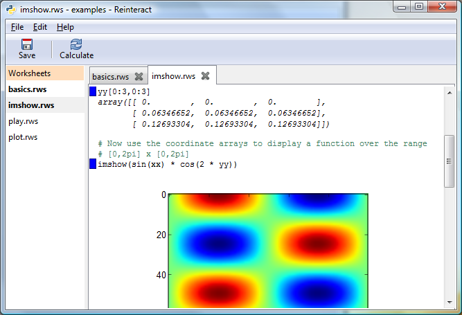

Design notes for Notebook Feature
----------------------------------

_Owen Taylor 2007-11-15_

The basic concept is to group multiple worksheets together into a ''notebook''. A notebook corresponds to a single project the user is working on, and in addition to the worksheets contains function libraries (modules) used by those worksheets. You might also have "data libraries" ... data read from sources such as audio files or HDF files that can be imported into the worksheets. The advantage of a data library over just reading the data directly in a worksheet is that the data can be read once and stored in memory once, used by different worksheets, and not re-read when the worksheets are re-executed.

On disk the representation of a notebook is simply a folder/directory. The folder contains at the toplevel, a file that stores notebook configuration, called, say, notebook.rnb (having an extension that can be associated in Windows is an advantage.) As with an Eclipse project (and unlike a Visual Studio project), all the files in the folder excepting files excluded by pattern in the configuration (*.pyc, *.pyo, etc), are shown in the user interface, and there is no need to add files to the project that are in the folder.

User Interface
--------------

The user interface concept is very simple ... on the left you have a display of the contents of the notebook, grouped by type with headers "Worksheets"; "Modules"; "Data Libraries"; "Files". In each section the folder structure is shown as a tree, but folders that have no files in a particular category are omitted. (How do you create new folders then?) Basic operations like "New", "Copy", "Delete", "Rename" are available in the right click menu.

On the right you have a set of tabs, one tab per open object (for modules, we can use !GtkSourceView for an editor.) The tab has indication of the status of the tab: a * if the tab is modified and needs saving, and for worksheets also an indication of whether the worksheet needs recompilation/reexecution (I'm imagining a yellow circle.)

Worksheets without notebooks
----------------------------

I think it's important to keep the current ability to work with a worksheet without having it be part of a Notebook. I don't like IDE's that create a dummy project to work with a single C file. Starting Reinteract without any arguments or opening a single unassociated worksheet shows just that worksheet, no notebook contents list or tabs. Then if you select "New Notebook", then Reinteract offers the choice of creating a notebook in the current folder including that worksheet, or selecting a different folder and starting from scratch. Note that opening a single pyw that *is* part of a Notebook is the same as opening the notebook and then opening the notebook. A worksheet in a notebook folder is always shown as part of its notebook.

Technical Details
-----------------

In general, implementation should be straightforward and mostly a question of implementing the user interface; worksheets are already well encapsulated to allow multiple ones in a single process, and there is even already a Notebook object. The trickiest part technically is probably, when a module is edited and saved, dumping the old version and reloading it, then finding out which parts of which open notebooks need to be marked for re-execution. Notebook.reset_module_by_filename() is supposed to do the first part, though it hasn't gotten much testing; the second part can be done by examining the scope for each statement, looking for module objects, then looking at the module object's _ _file_ _ attribute. That information could be cached efficiently if examining every variable in the scope for every statement in every worksheet ended up to be too slow.

Update
------

As of August 2008, notebooks are now working in the 'notebooks' branch. They basically work as described above, though I decided to deemphasize detached worksheets. There is now a default notebook 'Main' that you start in if no other notebook is specified on the command line. Here's a screenshot of notebooks working:

