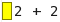
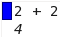
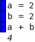
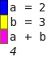
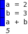
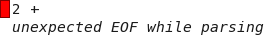
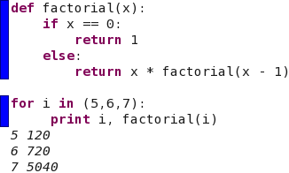
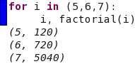
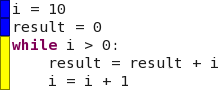
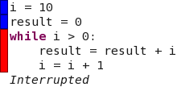

Worksheets and Notebooks
------------------------

When you use Reinteract, you enter Python expressions in a ''Worksheet''. Related worksheets can be combined together with libraries of Python functions and data files into a ''Notebook''. The first time you start Reinteract, it opens a notebook called "Main" and creates a new worksheet there. The Main notebook is a good place to do quick projects and play around with Reinteract and with Python. On subsequent times that you start Reinteract it remembers the notebook that you used last and the worksheets that were being edited within that notebook.

Start Reinteract now. If the Main notebook isn't open, open it by using "Open Notebook..." in the File menu. If necessary, create a new worksheet using "New Worksheet" in the File menu.

Basic Editing
-------------

We can now try out some basic editing of a worksheet. In the new worksheet, enter the text 2 + 2. You'll see a yellow rectangle next to the newly entered line:

The yellow color means that an expression has been entered but the result of the expression has not been calculate. To execute the statement and calculate the result, you can select "Calculate" in the File menu, or use the corresponding toolbar icon. You can also use the key shortcut Ctrl-Enter (⌘-Enter on the Macintosh). This is a good keyboard shortcut to learn since you will want to recalculate many times when using Reinteract. When you calculate, the yellow box changes to blue indicating that the result has been successfully calculated, and the result itself shows below:

You can also set variables within Reinteract, then use them. Try a slighly more complicated example:

Here the first two lines that assign a value to a and b don't have any result so nothing is printed when the worksheet is calculated, and a result is only printed for the third line which adds the two values together. The thing that makes Reinteract more powerful than a normal shell is that you can go back and change lines that you've already entered. Click on the second line to edit it and change the "2" to a "3":

The first line stays blue ... nothing needs to be done to it; it's already been executed. The second line changes from blue back to yellow indicated that it needs to be reexecuted. The third line changes from blue to purple. The purple color means that we've already executed the line before so we know it has correct syntax, but it needs to be executed again since a previous line has changed. (For most things the difference between yellow and purple doesn't matter ... if it's not blue, you need to calculate.) If you now calculate the worksheet again, everything turns back to blue and the result updates:

Errors
------

What if you mistype something. Try entering "2 +" into the worksheet and calculate:

The red color indicates and error, and the error is displayed below the result.

More complicated expressions
----------------------------

You aren't limited to simple expressions in Reinteract. Almost any valid Python can be entered including loops and function definitions:

If you enter the above you'll note that Reinteract remembers the indentation level for the previous line and is smart about increasing the indentation appropriately at the start of a block. Note the use of a print statement to output results with control over formatting. Any expression that returns a result will be displayed in the output, but the formatting might not be appropriate. If we change the line 'print i, factorial(i)' to read simply 'i, factorial(i)', the the result would look like:

Since Reinteract sees the output as a series of Python tuples.

Interrupting a long-running expression
--------------------------------------

By accident, you'll probably eventually write some code in Reinteract that takes a very long time (or forever) to run. Try entering:

(maybe you meant to write 'i = i - 1' instead.) When you calculate the worksheet now (try it), you'll see a wait cursor and the worksheet can't be edited while this calculation is running. You can interrupt the calculation by using "Break" in the "Edit" menu or the corresponding toolbar icon.

