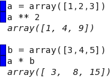
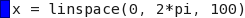
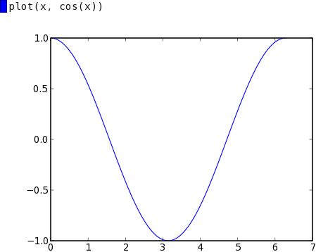
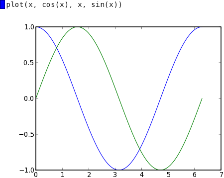
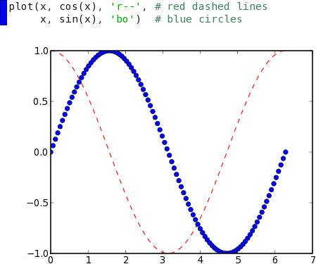

One of the interesting things you can do with Reinteract is to create graphical representations of results and include those results directly. In the examples in this section, we'll be using functionality from [Numpy](http://numpy.scipy.org) along with the replot module that is part of Reinteract.

Numpy is a large and powerful system, but most basically what it provides is the ability to operate on an array of data as if it was a single value. Some examples:

We'll use the Numpy function `linspace()` to create an array of data for our X values:

This creates an array of 100 equally spaced numbers between 0 and 2\*pi. We call `replot.plot` passing in two arrays: one to act as the X values and one to act as our Y values. The Y values that we'll plot are an array of 100 values derived by calling `sin` on each of the X values.

You can also plot multiple data sets in a single command by passing in several pairs of X and Y arrays:

`replot` uses the [matplotlib](http://matplotlib.sourceforge.net/) library to do its plotting. See the documentation for [Axes.plot()](http://matplotlib.sourceforge.net/matplotlib.axes.html#Axes-plot) for complete information about the arguments you can pass to `replot.plot`. As an example of a more complicated usage, you can pass style options for each plot:

